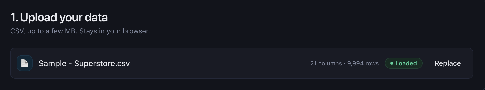
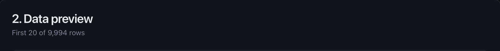
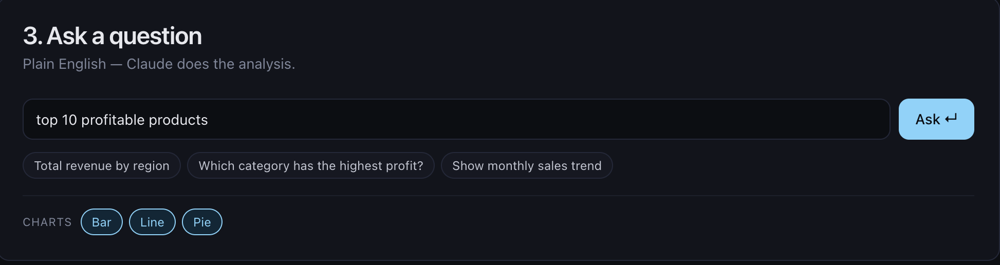
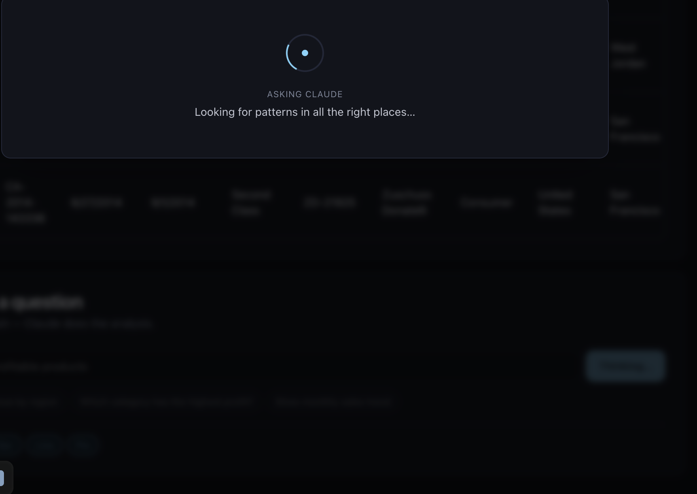
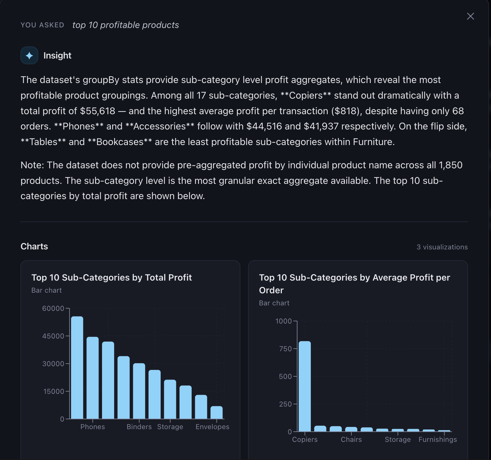

# Insight.csv

Drop a CSV. Ask questions in plain English. Get a clear, written insight and the right charts back from Claude.

A local-only React web app for AI-powered exploratory data analysis. No backend service to run, no separate API server — just `npm run dev`.

---

## Walkthrough

**1. Upload a CSV.** Drag and drop, or pick a file. Parsed in-browser by PapaParse — your data never leaves your machine without you asking it to.



**2. See a preview.** The first 20 rows render in a clean table so you know what you're working with.



**3. Ask a question.** Plain English, in the input. Suggested prompts below help you get going. Toggle which chart types Claude is allowed to use (Bar / Line / Pie) — the constraint is enforced at the JSON-schema level, so Claude *cannot* return a disallowed type.



**4. A modal opens with a spinner and a one-of-ten waiting line.** No funny lines on a loop — one per question.



**5. Read the insight, see the charts.** Same overlay swaps to a clean result view: your question echoed at the top, a written insight from Claude, then a responsive grid of 1–4 charts. Close with X / Esc / clicking the backdrop.



---

## How it works

```
┌──────────────────┐      POST /api/anthropic       ┌────────────────────┐
│  React app       │ ───────────────────────────▶   │ Vite dev server    │
│  (browser)       │   { question, columns/rows     │  (Node)            │
│                  │     OR { summary }, allowed    │                    │
│  PapaParse →     │     chart types }              │  + injects API key │
│  Dataset state   │                                │  from .env         │
│                  │ ◀───────────────────────────── │                    │
│  Recharts +      │      tool input as JSON        │  Anthropic SDK ──▶ │ ──▶ Claude
│  shadcn/ui       │                                │                    │
└──────────────────┘                                └────────────────────┘
```

The Vite dev server runs a small middleware plugin that proxies `/api/anthropic` to Anthropic's `messages` endpoint, attaching `ANTHROPIC_API_KEY` from `.env` server-side. **The key never reaches the browser bundle.**

Claude is forced to respond by calling a single `present_analysis` tool. That guarantees a structured `{ insight, charts }` shape — no JSON-from-prose parsing.

### Cost cap on large CSVs

Below 500 rows / 200 KB, the full CSV is sent to Claude. Above that, the browser computes a **DatasetSummary** — schema with inferred column types, exact per-column statistics over the *whole* dataset (count, nulls, min/max/mean/sum/p25/p50/p75 for numerics; top-10 values + counts for categoricals; min/max for dates), exact group-by tables for low-cardinality (≤20 distinct) categorical × numeric pairs, and a 100-row random sample for context. The summary serializes to a few KB regardless of whether the CSV is 5,000 or 5,000,000 rows. Claude reasons over the summary and uses the precomputed group-bys for exact column-level answers.

The system prompt tells Claude when it's working from a summary so it can flag any question that genuinely needs row-level detail it can't see.

## Tech stack

| Layer | Choice |
|---|---|
| Build / dev server | Vite |
| UI | React 18 + TypeScript |
| Styling | Tailwind CSS + shadcn/ui |
| Charts | Recharts |
| CSV parsing | PapaParse |
| LLM | Anthropic SDK (Claude Sonnet 4.6) |
| Tests | Vitest |
| Toasts | Sonner |

## Quick start

**Prerequisites:** Node 20+, an Anthropic API key from <https://console.anthropic.com/settings/keys>.

```bash
git clone https://github.com/TurkiOqab/Data_Analysis.git insight-csv
cd insight-csv
npm install

# Add your key (gitignored)
cp .env.example .env
echo "ANTHROPIC_API_KEY=sk-ant-..." > .env   # or edit the file directly

npm run dev
```

Open the URL Vite prints (default `http://localhost:5173/`), drop `samples/sales_q1.csv`, ask a question.

## Scripts

```
npm run dev        # start Vite dev server (with proxy)
npm run build      # type-check (tsc -b) and produce a production build
npm test           # run unit tests once
npm run test:watch # rerun tests on change
```

## Project structure

```
.
├── src/
│   ├── App.tsx                      # top-level state + layout
│   ├── main.tsx                     # React entry
│   ├── types.ts                     # Dataset, Chart, Result, DatasetSummary
│   ├── styles/globals.css           # Tailwind base + theme tokens
│   ├── components/
│   │   ├── UploadCard.tsx           # drag-drop CSV upload + size warning
│   │   ├── PreviewCard.tsx          # first-20-rows table
│   │   ├── AskCard.tsx              # question input, suggestions, chart-type toggles
│   │   ├── ResultOverlay.tsx        # modal: loading state + insight + charts
│   │   ├── ChartCard.tsx            # bar / line / pie via Recharts
│   │   └── ui/                      # shadcn/ui primitives
│   └── lib/
│       ├── csv.ts                   # PapaParse wrapper, type coercion
│       ├── csv.test.ts              # unit tests
│       ├── dataset-summary.ts       # threshold check + DatasetSummary computation
│       ├── dataset-summary.test.ts  # unit tests
│       ├── anthropic.ts             # POST /api/anthropic client
│       └── utils.ts                 # cn() helper
├── server/
│   ├── vite-anthropic-proxy.ts      # Vite middleware plugin
│   └── vite-anthropic-proxy.test.ts # unit tests
├── samples/
│   └── sales_q1.csv                 # smoke-test dataset
├── docs/
│   ├── DESIGN.md                    # design rationale
│   ├── PLAN.md                      # step-by-step build plan
│   └── screenshots/                 # README assets
└── CLAUDE.md                        # project conventions (Karpathy guidelines)
```

## Tests

33 unit tests across three files:

- `src/lib/csv.test.ts` — 4 tests, CSV parsing edge cases
- `src/lib/dataset-summary.test.ts` — 13 tests, schema inference / numeric stats / categorical top-K / date min-max / group-bys / sampling / threshold
- `server/vite-anthropic-proxy.test.ts` — 16 tests, request-shaping for full and summary modes plus chart-type filtering

```bash
npm test
```

UI components are verified manually — see the walkthrough screenshots above.

## Limitations

- **Local development only.** There is no production deployment story. The dev-server proxy is the only thing that hides the API key.
- **One question at a time.** No conversation history; each ask replaces the previous result.
- **Three chart types.** Bar, line, pie. No scatter, area, heatmap, etc.
- **No streaming.** Responses come back in a single message after Claude finishes.
- **Summary mode is approximate for row-level questions.** Column-level questions ("totals by region", "trend by month") use exact precomputed group-bys. Questions like "which individual transaction had the highest revenue" can only see the 100-row sample when the dataset is summarized — Claude is told to flag this.

## Roadmap

- Per-request cost display in the UI (the dev console already prints input / output / cache tokens per request).
- Optional Q&A history within a session.
- Export rendered insights and charts.

## Development notes

- The design rationale is in [docs/DESIGN.md](./docs/DESIGN.md).
- The original step-by-step build plan is in [docs/PLAN.md](./docs/PLAN.md).
- Project conventions for working in this repo are in [CLAUDE.md](./CLAUDE.md).

## License

MIT — see [LICENSE](./LICENSE).
